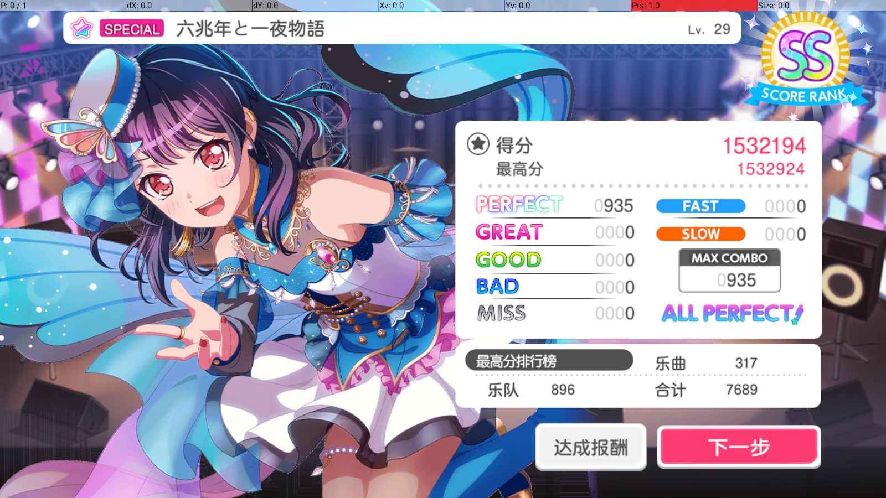
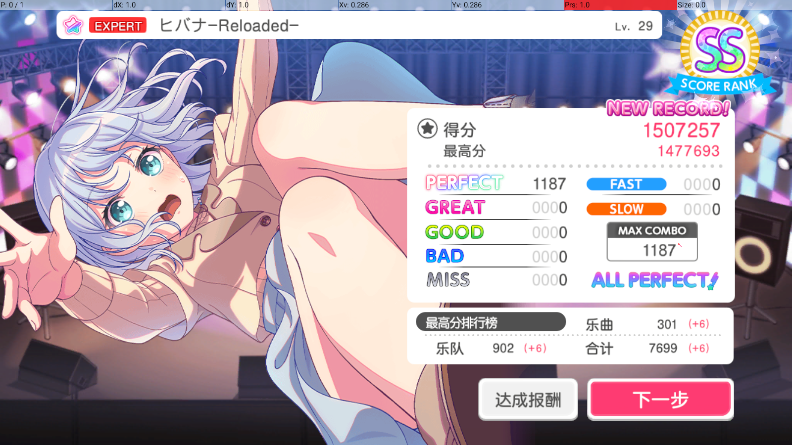

# Autodori  

A BanG Dream! helper

    

## Features

- [x] Auto game launch and auto live boost cleaning
- [x] Compatible with Windows, Mumu, and LDPlayer emulators
- [x] Optimized performance, low latency, and high accuracy
- [x] Chinese server support
- [ ] Auto reward collection and daily gacha
- [ ] Compatibility with Linux, macOS, and other emulators (pending IPCAPI support)
- [ ] Further improvements in accuracy and performance
- [x] Japanese and global server support
- [x] Proof is in the pudding! 👇

  
*SP 六兆年と一夜物語 AP*

  
*EX ヒバナ-Reloaded- AP*

  
*EX SENSENFUKOKU AP*

## How to Use

> [!IMPORTANT]  
> Before using this script, make sure that the prerequisites are:
>
> 1. Ensure adequate equipment and simulator performance
> 1. Set the simulator resolution to a value of 16:9, recommended (1600,900) or (1280,720)
> 1. The song selection list is "normal". It is recommended to clear the restore filter
> 1. In the game "Performance Settings", adjust the flow rate to 8.0
> 1. In the game's "Performance Effect·Volume Setting", turn off "3D Cut-in Mode" and change "Action Mode" to "Lightweight Mode"
> 1. For a better experience, you can enable "FAST/SLOW Representation" and "Perfect Status Display" in the game "Performance Effect·Volume Setting"
> 1. Connect to the simulator using adb

1. Download the latest version from [Releases](https://github.com/EvATive7/autodori/releases)  
2. Extract the folder and run `autodori.exe`
3. Use the command line `autodori.exe -h` to view more options

> [!TIP]  
> If you're comfortable with coding, or need to tweak settings / optimize for score pushing / testing or development purposes, run from source:  
>
> 1. `git clone` this repository  
> 2. `cd autodori`  
> 3. `python -m venv .venv`  
> 4. `.venv\Scripts\activate`  
> 5. Install dependencies: `pip install -r requirements.txt`

## Note

1. It is recommended to use the latest version of Mumu emulator. It was tested less frequently on the LDPlayer and appeared to have performance issues.
1. The script is not yet complete and errors may occur. Welcome to post Issue and PR.
