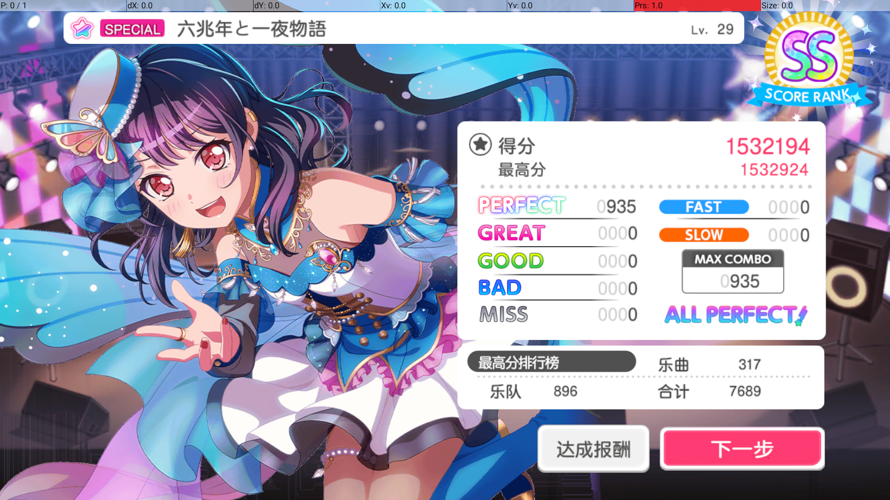
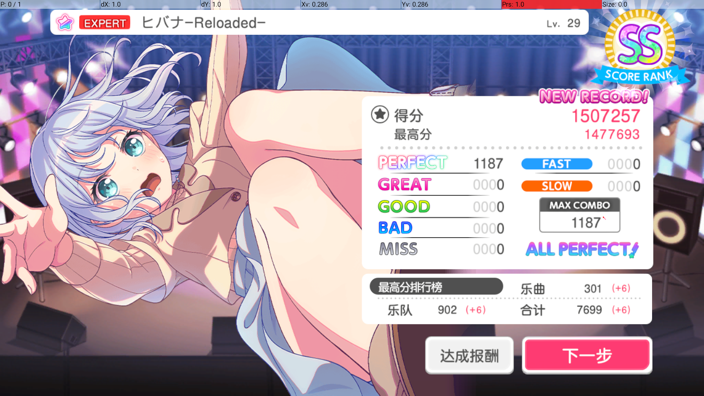

# autodori

BanG Dream! ヘルパー | [中文](./README.md) | [English](./README.en.md)

    

## ✨ 機能

- [x] ゲームの自動起動と自動演奏
- [x] Windows、Mumu、Mumu V5、LDPlayer に対応
- [x] 低負荷、低遅延、高精度
- [x] 中国版サーバーで利用可能
- [ ] 報酬の自動受け取り、自動デイリーガチャ 3 回
- [ ] Linux、macOS、その他のエミュレーターへの対応
- [ ] さらなる精度向上とパフォーマンス最適化
- [ ] 日本版およびグローバル版サーバーへの対応
- [x] プレイ結果の確認 👇

  
*SP 六兆年と一夜物語 AP*

  
*EX ヒバナ-Reloaded- AP*

  
*EX SENSENFUKOKU AP*

## 🛠 使い方

> [!NOTE]
> 議論・開発用 QQ グループ：1044289381

> [!IMPORTANT]
> このスクリプトを使用する前に、以下を確認してください。
>
> 1. デバイスとエミュレーターが十分な性能を備えていること
> 1. エミュレーターの解像度を 16:9 に設定すること。1600x900 または 1280x720 を推奨します
> 1. 楽曲リストを「Normal」にし、楽曲フィルターを解除することを推奨します
> 1. ゲームの「ライブ設定」でノーツ速度を 8.0 に設定すること
> 1. ゲームの「ライブ演出・音量設定」で「3D カットインモード」を無効にし、「アクションモード」を「軽量モード」に設定すること
> 1. より良い結果を得るには、「ライブ演出・音量設定」で「FAST/SLOW 表示」と「Perfect 表示」を有効にすること
> 1. エミュレーターを起動し、ADB が正常に動作すること

### 通常利用

1. [リリース](https://github.com/EvATive7/autodori/releases)から最新版をダウンロードします
2. 解凍して `autodori.exe` を実行します

### パラメーター調整、コード変更、テスト、開発を行う場合

1. [uv](https://docs.astral.sh/uv/) をインストールします。
2. `git clone --recursive https://github.com/EvATive7/autodori`
3. `cd autodori`
4. `uv sync --group build`
5. `uv run python build.py`
6. `dist\autodori\autodori.exe` を実行します。

## ⚠️ 注意

1. 最新版の Mumu エミュレーターを推奨します。LDPlayer でのテスト回数は少なく、パフォーマンス上の問題が発生する場合があります。
2. このプロジェクトはまだ完成していないため、エラーが発生する可能性があります。Issue や PR を歓迎します。

## 📝 リスク、利用制限、免責事項、ライセンス、著作権

このプロジェクトは、プレイヤーがゲームや育成をより快適に楽しめるよう支援することを目的としています。ゲームの公平性を損なう目的で使用することは禁止されています。BanG Dream! のゲーム環境を大切にし、ゲームのルールを守ってください。

このプロジェクトはランキング上位を目指す用途には使用できません。ランキング参加者に対しては公式による追加検知が行われます。エミュレーター上での実行や通常とは異なる入力方式は高リスク要因であり、ランキング目的で使用するとほぼ確実にアカウント停止につながります。

本プロジェクトはオープンソースかつ無料で提供されます。個人または組織による商用利用・配布は禁止されています。商用利用を発見した場合は、各プラットフォームから報告してください。

本プロジェクトの使用または使用不能によって発生した直接的・間接的な損害について、本プロジェクトおよび開発者は責任を負いません。利用者は自身の判断でリスクを評価し、引き受けるものとします。

本プロジェクトは GPLv3 ライセンスで公開されています。変更、複製、配布の際は[プロジェクトライセンス](LICENSE)に従ってください。
Python パッケージ以外に、本プロジェクトが直接使用、変更、または配布するオープンソースコード、コンポーネント、バイナリは以下のとおりです。

- [minitouch ver.EvATive7](https://github.com/EvATive7/minitouch)（Apache License 2.0）
- [MaaFramework](https://github.com/MaaXYZ/MaaFramework)（LGPLv3）
- [MFAAvalonia](https://github.com/MaaXYZ/MFAAvalonia)（GPLv3）

本プロジェクトは以下のプロプライエタリな DLL を配布します。これらはオープンソースプロジェクトの一部ではなく、本プロジェクトのライセンスの対象外です。

- msvcp140.dll
- vcruntime140.dll
